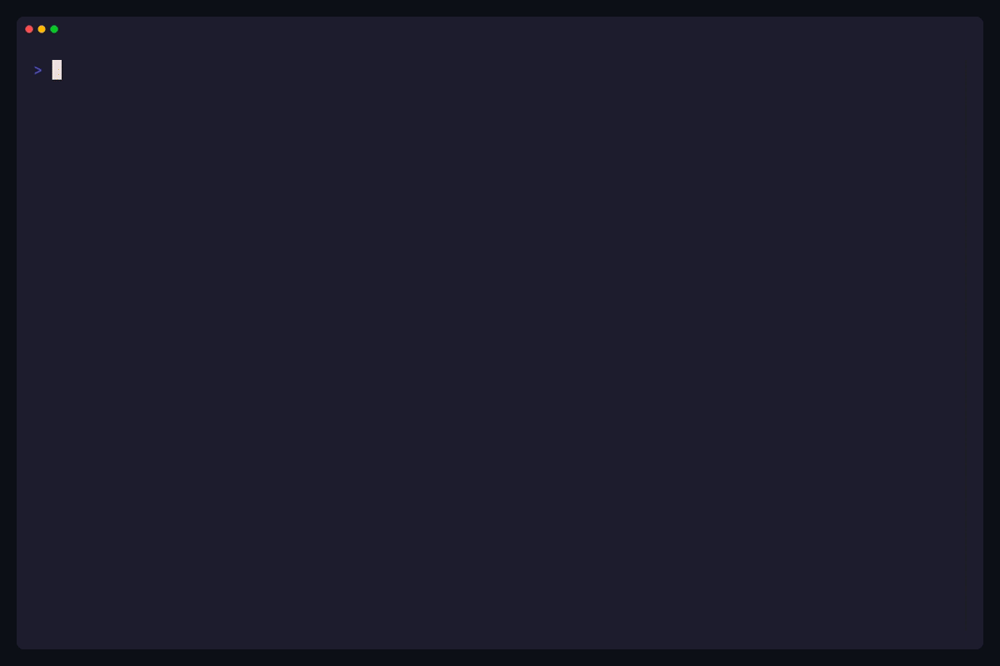
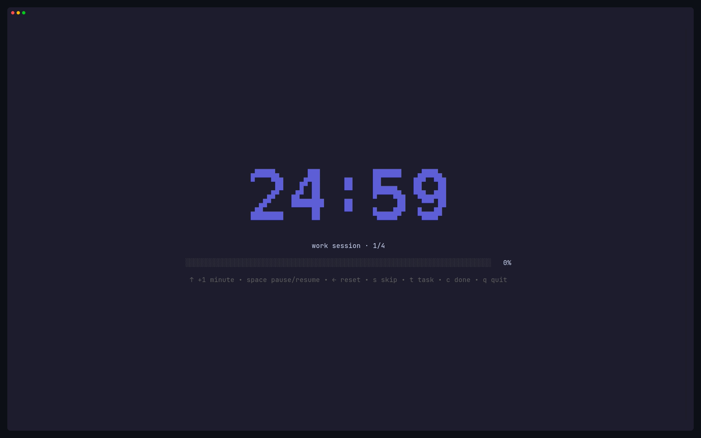
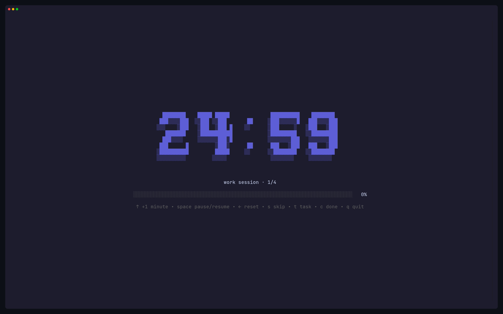
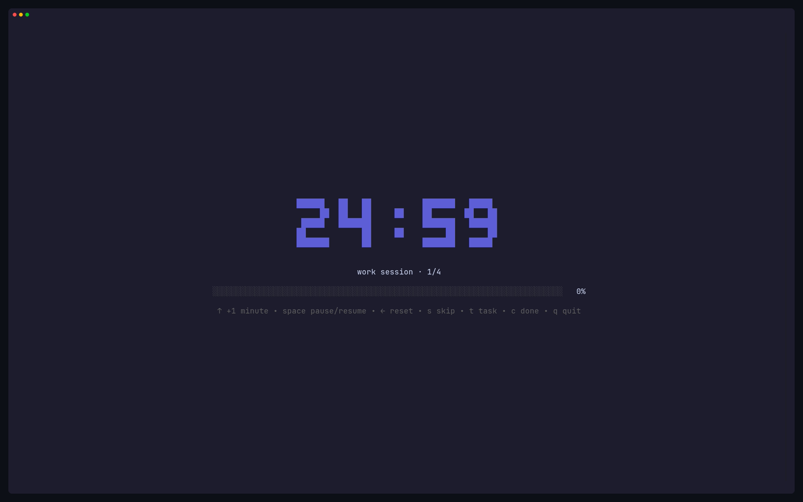
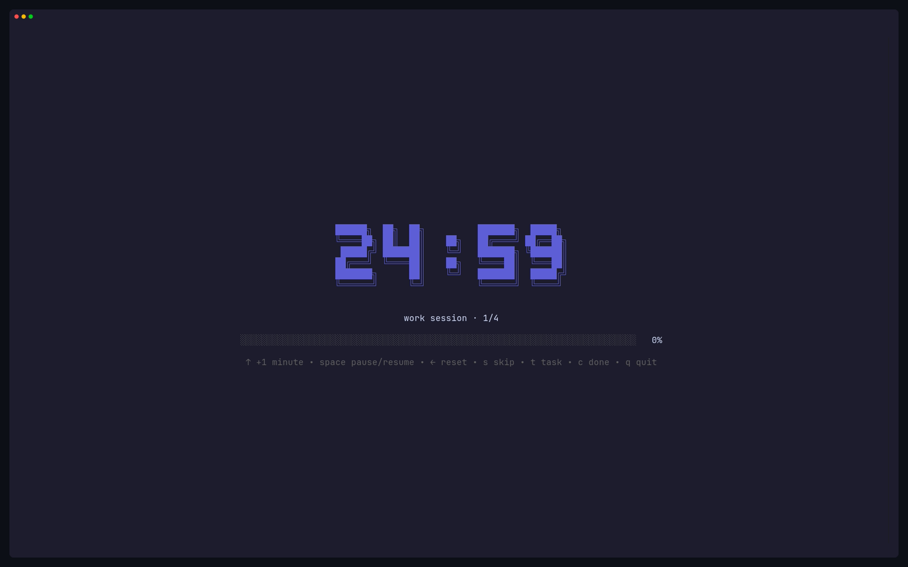

# pomo — Pomodoro TUI with Persistent Task Context

[](https://github.com/Nerver-zip/pomo/releases/latest)
[](https://opensource.org/licenses/MIT)



**pomo** is a timer-first Pomodoro timer TUI application written in Go with [Bubble Tea](https://github.com/charmbracelet/bubbletea), evolved from [Bahaaio/pomo](https://github.com/Bahaaio/pomo).

It introduces a lightweight, frictionless layer of **persistent tasks linked to Pomodoro sessions** while keeping the large, central timer as the undisputed hero of the interface.

---

## 🧭 Philosophy: Timer-First, Context-Driven

> *A Pomodoro is focus spent on a concrete task, rather than just an abstract interval.*

1. **Zero Friction for Untracked Sessions:** Running `pomo` or `pomo 30m` starts an untracked session immediately. You are never forced to create a task or interrupted by startup modals.
2. **Anti-Scope Creep:** Tasks are lean (`id`, `title`, `description`, `status`, `created_at`, `completed_at`). No Kanban boards, no calendars, no subtask trees, and no bloated dashboards.
3. **Flow State Across Breaks:** Work sessions link to your active task. Breaks are cognitive rest (`task_id = NULL`). When a break concludes, the active task remains selected for your next work sprint.

---

## ✨ Features

- ⏱️ **Hero Timer:** Large ASCII art timer or minimal clean layout.
- 📋 **Persistent Tasks:** Link focus sessions to concrete tasks in SQLite (`WAL` mode).
- 🔄 **Session Chaining & Flow Retention:** Active task binding sticks across break intervals.
- ⚡ **In-TUI Task Management:** Press `t` to pick or create tasks without leaving the timer.
- ⌨️ **Quick Complete:** Press `c` mid-session to mark the active task completed.
- 🔔 **Desktop Notifications:** Cross-platform notifications when sessions finish.
- 📊 **Exit Summary:** Formatted end-of-session report displaying time spent on your active task.
- 📈 **Productivity Analytics:** Visual dashboard with heatmaps, streaks, and per-task focus stats.
- 📁 **Full XDG Compliance:** Seamless schema migration for existing databases.

---

## 🎨 Timer Fonts

`pomo` supports 4 ASCII art fonts for the hero timer, configurable via `asciiArt.font` in `pomo.yaml`:

<!-- prettier-ignore -->
|              **mono12**              |                  **rebel**                   |
| :----------------------------------: | :------------------------------------------: |
|  |            |
|               **ansi**               |                **ansiShadow**                |
|      |  |

---

## 🚀 Quick Start

### 1. Untracked Sessions (Classic Pomo)

```bash
pomo                    # Start default work session (e.g. 25m)
pomo 30m                # Start 30-minute work session
pomo 45m 15m            # 45m work with 15m break
pomo break              # Start 5-minute break
pomo break 10m          # Start 10-minute break
```

### 2. Focus on a Persistent Task

```bash
# Attach task by ID at launch
pomo -T 1
pomo --task 1 30m

# Or use the task start shortcut
pomo task start 1
```

---

## 📋 Task Management CLI

`pomo` includes a dedicated `task` subcommand suite:

```bash
# Add a new task
pomo task add "Refactor parser" -d "Implement AST visitor pattern"

# List pending tasks
pomo task list

# List completed tasks
pomo task list --done

# List all tasks
pomo task list --all

# Edit an existing task
pomo task edit 1 -t "Refactor parser & lexer" -d "Updated notes"

# Mark task as completed
pomo task done 1

# Reopen a completed task
pomo task reopen 1

# Delete a task
pomo task delete 1

# View focus metrics for a specific task
pomo task stats 1
# or via stats command:
pomo stats -T 1
```

---

## ⌨️ Keyboard Controls

### In-Timer Controls

| Key | Action |
| --- | --- |
| `Space` | Pause / Resume timer |
| `↑` / `k` / `+` | Increase time by 1 minute |
| `←` / `h` | Reset to initial duration |
| `s` | Skip to next session |
| `t` | **Open Task Picker overlay** |
| `c` | **Mark active task completed** |
| `q` / `Ctrl+C` | Quit session and display summary |

### Task Picker Overlay (`t`)

| Key | Action |
| --- | --- |
| `↑` / `↓` / `k` / `j` | Navigate tasks |
| `Enter` | Select task and bind to timer |
| `n` | Create a new task (opens modal form) |
| `e` | Edit selected task |
| `c` | Mark selected task completed |
| `Esc` / `q` | Close picker without changing task |

---

## 📊 Session Exit Summary

When quitting or completing sessions, `pomo` prints an informative summary:

```text
Session Summary:
 Focused Task: #1 Refactor parser (2 sessions · 50m0s)
 Work : 50m0s (2 sessions)
 Break: 5m0s (1 session)
 Total: 55m0s

 [███████████████████████████░░░] 91% work
```

---

## 🛠️ Configuration & Database

### Configuration File

`pomo` looks for its configuration file in:
1. `./pomo.yaml` (Current directory)
2. `$XDG_CONFIG_HOME/pomo/pomo.yaml` (or `~/.config/pomo/pomo.yaml`)

See [pomo.yaml](pomo.yaml) for available options (ASCII art fonts, notifications, hooks).

### Database & Migrations

The SQLite database is stored at:
- `$XDG_STATE_HOME/pomo/pomo.db` (or `~/.local/state/pomo/pomo.db`)

**Seamless Migrations:** Existing databases from older versions of `pomo` are automatically and safely migrated on first launch, adding task support without touching or losing any historical session data.

---

## 📦 Installation

### From Source

```bash
git clone https://github.com/Nerver-zip/pomo
cd pomo
go build -o pomo .
```

### Go Install

```bash
go install github.com/Nerver-zip/pomo@latest
```

### Nix Flake

```bash
nix run github:Nerver-zip/pomo
```

---

## 📄 License & Attribution

`pomo` is licensed under the [MIT License](LICENSE).

This project is a fork and evolution of [Bahaaio/pomo](https://github.com/Bahaaio/pomo), originally created by Bahaa Mohamed. We are deeply grateful for their elegant TUI foundation.
